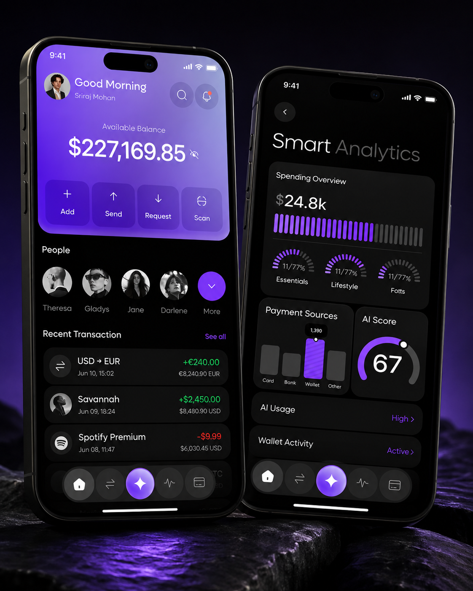
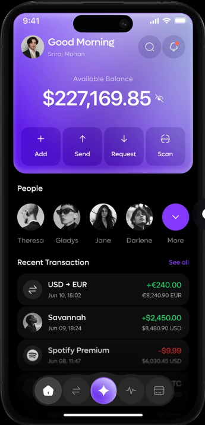
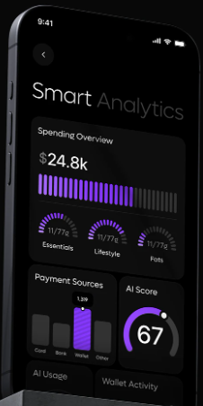

# Aura Bank

Protótipo de aplicativo bancário desenvolvido em **React Native + TypeScript + Expo**, com foco em fidelidade visual ao design de referência e organização inspirada em **Clean Architecture**.

O objetivo do projeto é demonstrar uma interface bancária moderna, dark e premium, com componentes reutilizáveis, dados desacoplados da apresentação e uma estrutura preparada para substituir a fonte mockada por um backend real sem reescrever as telas.

## Preview

### Mockup

<p align="center">
  
</p>

### Home

<p align="center">
  
</p>

### Smart Analytics / Gastos

<p align="center">
  
</p>


## Stack

- React Native
- TypeScript
- Expo SDK 54
- Expo Go
- Expo Router
- Expo Linear Gradient
- React Native SVG
- React Native Safe Area Context
- Expo Vector Icons / Ionicons


## Como executar

Tenha Node.js instalado e o Expo Go no celular.

```bash
npm install
npx expo start
```

